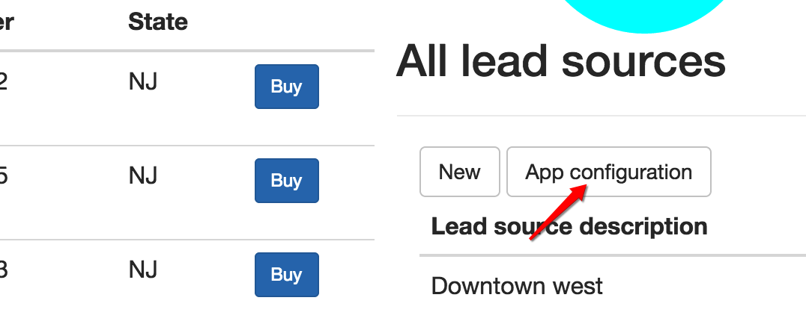
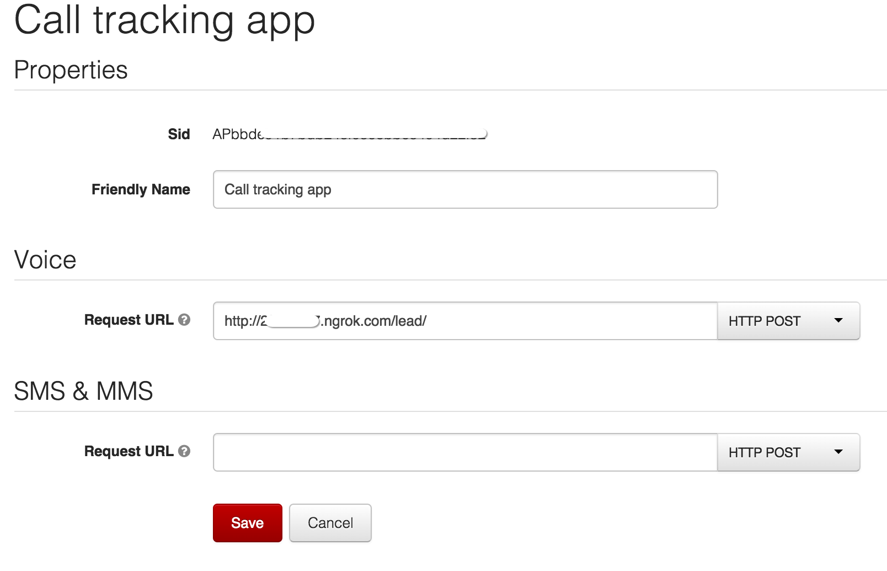

#  Call tracking using Twilio and Laravel

[](https://travis-ci.org/TwilioDevEd/call-tracking-laravel)

This application demostrates how to use Twilio track calls and measure
the effectiveness of marketing campaigns

## Running locally

### The web application

1. Clone the repository, copy the included `env.example` as `.env` and
   customize it to your needs. If you already have a
   [TwiML app under your account](https://www.twilio.com/user/account/apps)
   you'd like to use, you will also need to specify its SID.
2. Use composer to install the app's dependencies by running `composer
   install` in the repo's root
3. Run the database migrations using `php artisan migrate`. If the
   database is configured correctly in `.env` this will get you a
   working database
4. Go to `http://localhost:8000/dashboard`. If everything is
   configured correctly you should see a dashboard and some numbers
   you can buy through Twilio's API. Buy at least one number and start
   calling the lead sources.

### Exposing the app via ngrok

For this demo it's necessary that your local application instance is
accessible from the Internet. The easiest way to accomplish this
during development is using [ngrok](https://ngrok.com/). If you're
running OS X you can install ngrok using Homebrew by running `brew
install ngrok`. First you will need to run the application and make
sure it's bound to `127.0.0.1` so ngrok can find it:

```
php artisan serve --host=127.0.0.1
```

After this you can expose the application to the wider Internet by
running (port 8000 is the default for Laravel):

```
ngrok 8000
```

### Configuring the TwiML app to forward calls

Go to `http://localhost:8000/dashboard` and click "App Configuration"
right under "All lead sources". This will take you either to a newly
create TwiML app under your account or to the application configured
in the `TWILIO_APP_SID` variable. Edit the application and sets its
request URL to `http://<your-ngrok-id>/lead` and make sure the method
is set to POST. Click save to finish.



Configuring the app under your Twilio account:



### Running the tests

The tests interact with the database so you'll first need to migrate
your test database. First, set the `DATABASE_URL` to your test
database and then run.

`php artisan migrate`

Make sure you have `TWILIO_APP_SID` set so the app does not attempt to
look it while running the tests. Then tests then can be run using:

`phpunit`
